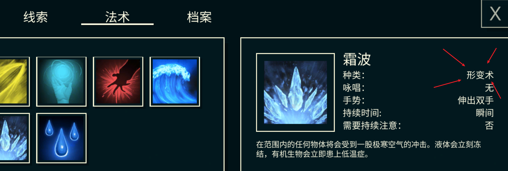
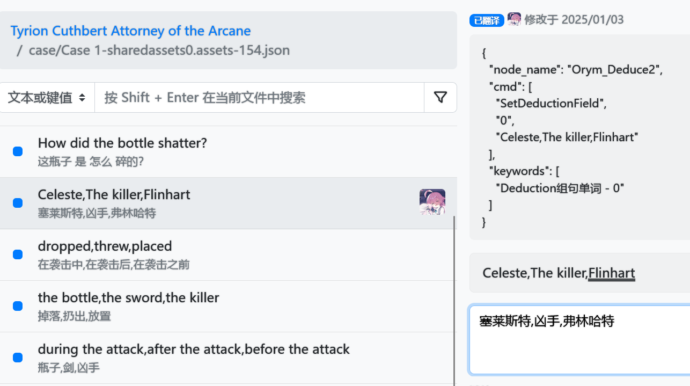
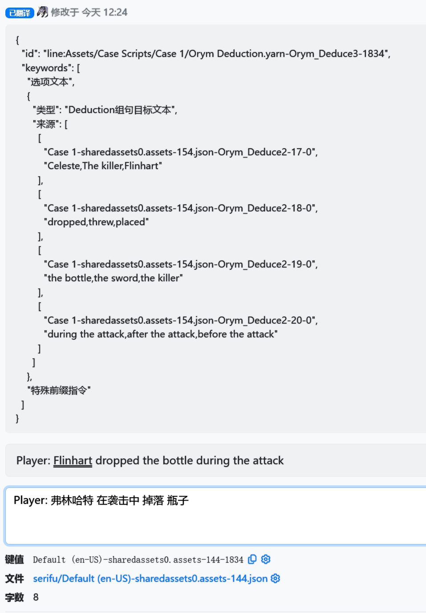

文件组织：

<details>
<summary> 本文件夹内的文件组织和用途说明 </summary>
```shell
"Texts/"
├── "charalist"
├── "@dist" # 最终生成的文件，用于 UABEA[Next] 读取导入，按 data.unity3d 内部格式组织
│   ├── "il2cpp_data"  # global-metadata.dat 汉化
│   ├── "level0"
│   └── "resources"
│   └── "sharedassets0"
├── "@old"  # @raw, 原始文件，read-only
│   ├── "case"
│   ├── "m_text"
│   ├── "metadata"  # global-metadata.dat 文本导出
│   ├── "save"      # 读档存档删档相关提示文本
│   ├── "serifu"
│   ├── "tooltips"
│   ├── "CharacterLibrary-level0-599.json"
│   ├── "EpisodeLibrary-level0-607.json" # override 相关文本，例如红衣女孩的职业（注意这部分文本会写入到存档，因此需要重新建档才能看到修改）
│   ├── "ItemLibrary-level0-603.json"
│   ├── "LocationLibrary-level0-604.json"
│   └── "SpellLibrary-level0-602.json"
├── "@paraz" # `just export` 命令导出文件，用于 paratranz
│   ├── "case"       # Case 字节码文本
│   ├── "charalist"  # 人物定义文本
│   ├── "episode"    # 章节内部初始化的重定义文本
│   ├── "item"       # 物品文本
│   ├── "location"   # 地点文本
│   ├── "m_text"     # 控件，按钮文本
│   ├── "metadata"   # 程序内硬编码的文本（例如添加线索，退出游戏，法术类型`enum spellSchool`之类的）
│   ├── "serifu"     # 台本，Case 字节码中的多语言定义文本
│   ├── "save"       # 读存删档文本
│   ├── "spell"      # 咒语文本
│   └── "tooltips"   # 几个按钮上的注释文本
├── "@paraz-out" # Paratranz 导出文件，和 @paraz 相同但是包含了汉化，手动或者GitHub Action导出
│   ├── .. 略 ..
├── "utils"          # Texts 相关的导入导出函数
│   ├── "case.py"
│   ├── "charalist.py"
│   ├── "flags.py"
│   ├── "__init__.py"
│   ├── "item.py"
│   ├── "m_text.py"
│   ├── "serifu.py"
│   ├── "spell.py"
│   ├── "tooltips.py"
│   ├── "yarn_spinner_pb2.py"  # 根据 yarnspinner 2.2.1 版本的 yarn_spinner.proto 定义文件，通过 protoc --python_out=.  ./yarn_spinner.proto 生成
│   └── "yarn_spinner.proto"   # 从 yarnspinner 2.2.1 中偷出来的
│   ├── .. 略 ..
├── "chinese.txt"     # `just charset` 生成的码表
├── "get_chars.py"    # `just charset` 用到的脚本
├── "readme.md"
└── "text_io.py"      # 核心的文本导入导出脚本，用于`just import|export`
```
</details>
## global-metadata.dat 特殊说明

### 常规文本

游戏的一部分文本在 `global-metadata.dat` 中，可以通过 [ il2cpp-stringliteral-patcher ](https://github.com/jozsefsallai/il2cpp-stringliteral-patcher/tree/master) 修补 `global-metadata.dat`。

### 特殊文本



游戏中法术类型由 `enum spellSchool` 控制：
```c#
// Token: 0x0200002D RID: 45
	[Token(Token = "0x200002D")]
	public enum School
	{
		// Token: 0x040000FD RID: 253
		[Token(Token = "0x40000FD")]
		Evocation,
		// Token: 0x040000FE RID: 254
		[Token(Token = "0x40000FE")]
		Transmutation,
		// Token: 0x040000FF RID: 255
		[Token(Token = "0x40000FF")]
		Conjuration,
		// Token: 0x04000100 RID: 256
		[Token(Token = "0x4000100")]
		Divination,
		// Token: 0x04000101 RID: 257
		[Token(Token = "0x4000101")]
		Illusion,
		// Token: 0x04000102 RID: 258
		[Token(Token = "0x4000102")]
		Abjuration,
		// Token: 0x04000103 RID: 259
		[Token(Token = "0x4000103")]
		Necromancy
	}
```

这部分文本实际上是通过 enum.toString 的方式生成的，因此我们需要修改 global-metadata.dat 中的非常量 string 相关的部分。

这部分文本通过 il2cppdumper 的[源码](https://github.com/Perfare/Il2CppDumper/blob/4741d46ba9cd6159c5d853eb9d6fc48b4bfa2b1a/Il2CppDumper/Il2Cpp/MetadataClass.cs#L13)可知，在 `global-metadata.dat` 文件的 0x18 处的 int32 位置是所有 string 的偏移（下称 `string_base`）。之后所有对文本的索引用的是相对于`string_base`的偏移，以 \x00 结尾（aka，不包含长度信息）

实际上观察发现，翻译后的文本所用的字节数比原英文文本的字节数要少，因此我们可以直接原地 patch 对应的 string，之后修改 `enum` 索引字符串的偏移（详见 `scripts/patchMetaData.py`），基本上的实现就是爆搜对应的 consts，好在程序中没有重复的 entry。

## 其他常规说明

### Serifu 台本（Default (US) xxxxx）

这个是 yarnspinner 的正规国际化文件，包含了每句文本的 key-value 对。但是由于程序中 文本、tag、指令 全部混在这个文件里面，因此需要区分出来哪些是指令，哪些是标签，哪些是真正可以翻译的对话文本。

### Episode

这个其实大部分是 `initState` 章节的参数数据，但是里面有一个比较坑的 `xxxOverrides`，这个地方存放了一些临时的修正数据，例如：

```json
"occupationOverrides": {
    "Array": [
      {
        "key": "Celeste McCoy",
        "value": "Mercenary"
      }
    ]
},
```

这个会修改章节内某个人物的职业 `occupation`，同时由于这个属性会被读入到存档中，因此汉化完这个字段后必须重新开档才能看到结果。

## Case 特别说明

### Case 内文本

Case 内文本主要在 `lineMetadata` 内部，目前发现的有 `alias:xxxx` 系文本，主要用于临时出现的人物的伪装文本。例如：
```
  "alias:Girl_Dressed_in_Red",
  "emo:Sad alias:Girl_Dressed_in_Red",
  "emo:Exasperated alias:Girl_Dressed_in_Red",
  "emo:Angry alias:Girl_Dressed_in_Red shake",
  "emo:Angry shake alias:Girl_Dressed_in_Red",
  "emo:Exasperated shake alias:Girl_Dressed_in_Red",
  "emo:Neutral alias:Girl_Dressed_in_Red",
```

这部分文本显示上是把 _ 替换为空格后直接显示，因此直接汉化所有的 `alias:xxx` 即可。

### YarnSpinner 字节码文本

这部分文本内嵌在 yarn script 中。位于 `Case 1-sharedassets0.assets-154.json` 这种文件内部的 compiledYarnProgram 字节码内。

经过看 yarnspinner 源代码可知，这部分脚本通过虚拟机执行，通过观察发现，这些其实是 protobuf 编译后的二进制，<del>因此可以使用 `protoscope` 直接编辑文本。</del>

切换到 yarn-spinner 2.2.1 版本，可以直接利用 yarn.proto 定义文件生成对应的 python protobuf 解析文件来解析 protobuf，获得对应的 inst 虚拟机指令。

通过分析 RunCommand 指令过滤出所有内嵌文本 instruction，之后对这些文本进行提取汉化。

在 @Work 里面执行如下命令生成 instruction dump（脚本可以在 Scripts 内找到）
```shell
# fishshell
for i in *.json ; python3 extractCaseYarnBinary.py $i; end
for i in *.json.bin; python3 dump_insts.py $i > $i.txt; end
```

#### Item 选择判断

对于如下命令，通过 `PresentPrompt` 唤出的证据窗口，会选择一个物品/Spell/人物，此时会拿到对应物品的 Name（非 displayName）。
```shell
1, instruction { ['opcode: RUN_COMMAND', 'operands {', '  string_value: "PresentPrompt"', '}', 'operands {', '  float_value: 0', '}'] }
2, instruction { ['opcode: ADD_OPTION', 'operands {', '  string_value: "line:Assets/Case Scripts/Case 1/Merchant Argument.yarn-Merchant_Present-1719"', '}', 'operands {', '  string_value: "L6shortcutoption_Merchant_Present_1"', '}', 'operands {', '  float_value: 0', '}', 'operands {', '  bool_value: false', '}'] }
3, instruction { ['opcode: ADD_OPTION', 'operands {', '  string_value: "line:Assets/Case Scripts/Case 1/Merchant Argument.yarn-Merchant_Present-1723"', '}', 'operands {', '  string_value: "L7shortcutoption_Merchant_Present_2"', '}', 'operands {', '  float_value: 0', '}', 'operands {', '  bool_value: false', '}'] }
4, instruction { ['opcode: SHOW_OPTIONS'] }
```

接下来判断根据如下两个文本 Key 进行，因此这种文本不能翻译，需要保持和 Item name 一致。
```json
{
"key": "Default (en-US)-sharedassets0.assets-144-1719",
"original": "Store-Bought Orange Juice",
"translation": "Store-Bought Orange Juice",
},
{
"key": "Default (en-US)-sharedassets0.assets-144-1723",
"original": "Default",
"translation": "Default",
},
```

#### LoadTalk 相关文本

这部分没什么好说的，所有 LoadTalk 指令下面的 ADD_OPTIONS 文本都会直接显示在对话框中，直接翻译使用就行了。


#### Deduction 相关文本


观察发现 `SetDeductionField` 会有对应的文本。
```shell
16, instruction { ['opcode: RUN_COMMAND', 'operands {', '  string_value: "ClearDeductionFields"', '}', 'operands {', '  float_value: 0', '}'] }
17, instruction { ['opcode: RUN_COMMAND', 'operands {', '  string_value: "SetDeductionField 0 \\"Celeste,The killer,Flinhart\\""', '}', 'operands {', '  float_value: 0', '}'] }
18, instruction { ['opcode: RUN_COMMAND', 'operands {', '  string_value: "SetDeductionField 1 \\"dropped,threw,placed\\""', '}', 'operands {', '  float_value: 0', '}'] }
19, instruction { ['opcode: RUN_COMMAND', 'operands {', '  string_value: "SetDeductionField 2 \\"the bottle,the sword,the killer\\""', '}', 'operands {', '  float_value: 0', '}'] }
20, instruction { ['opcode: RUN_COMMAND', 'operands {', '  string_value: "SetDeductionField 3 \\"during the attack,after the attack,before the attack\\""', '}', 'operands {', '  float_value: 0', '}'] }
21, instruction { ['opcode: RUN_COMMAND', 'operands {', '  string_value: "Deduction \\"How did the bottle shatter?\\""', '}', 'operands {', '  float_value: 0', '}'] }
22, instruction { ['opcode: PUSH_STRING', 'operands {', '  string_value: "Orym_Deduce3"', '}'] }
23, instruction { ['opcode: RUN_NODE'] }
```

之后跳转 `Orym_Deduce3` 节点
```shell
Orym_Deduce3
0, instruction { ['opcode: RUN_COMMAND', 'operands {', '  string_value: "SetDialogueActive false"', '}', 'operands {', '  float_value: 0', '}'] }
1, instruction { ['opcode: ADD_OPTION', 'operands {', '  string_value: "line:Assets/Case Scripts/Case 1/Orym Deduction.yarn-Orym_Deduce3-1834"', '}', 'operands {', '  string_value: "L7shortcutoption_Orym_Deduce3_1"', '}', 'operands {', '  float_value: 0', '}', 'operands {', '  bool_value: false', '}'] }
2, instruction { ['opcode: ADD_OPTION', 'operands {', '  string_value: "line:Assets/Case Scripts/Case 1/Orym Deduction.yarn-Orym_Deduce3-1835"', '}', 'operands {', '  string_value: "L8shortcutoption_Orym_Deduce3_2"', '}', 'operands {', '  float_value: 0', '}', 'operands {', '  bool_value: false', '}'] }
3, instruction { ['opcode: SHOW_OPTIONS'] }
4, instruction { ['opcode: JUMP'] }
```

观察可知，两个判断对应的文本为：
```json
{
"key": "Default (en-US)-sharedassets0.assets-144-1834",
"original": "Player: Flinhart dropped the bottle during the attack",
"translation": "",
},
{
"key": "Default (en-US)-sharedassets0.assets-144-1835",
"original": "Player: Fail",
"translation": "",
},
```

对应游戏中的表现为：


因此可知，拼句子完成后会根据对应的文本做判断来决定跳转那个分支，（aka label L7shortcutoption_Orym_Deduce3_1 指向的 pc）。

所以，在汉化的时候对于这些文本需要做特别判断，告诉翻译如何修改对应的语句。

注意，由于游戏的程序拼句子的时候会自动加上空格，因此目标句子也要加上空格，不过这个仅起到判断作用，不会被游戏本身显示。





