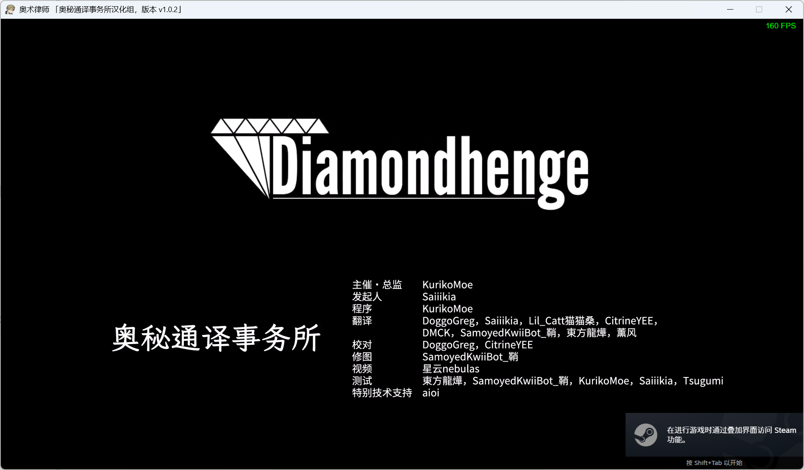
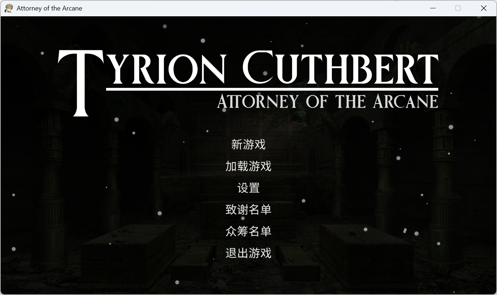
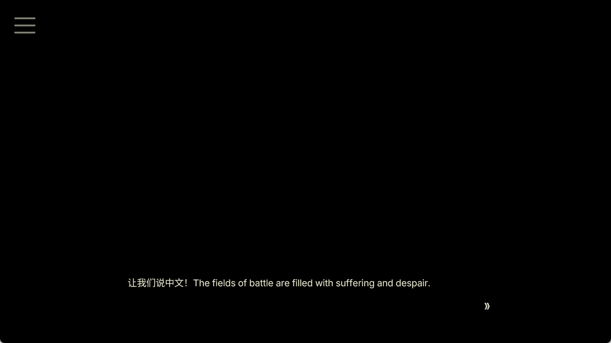
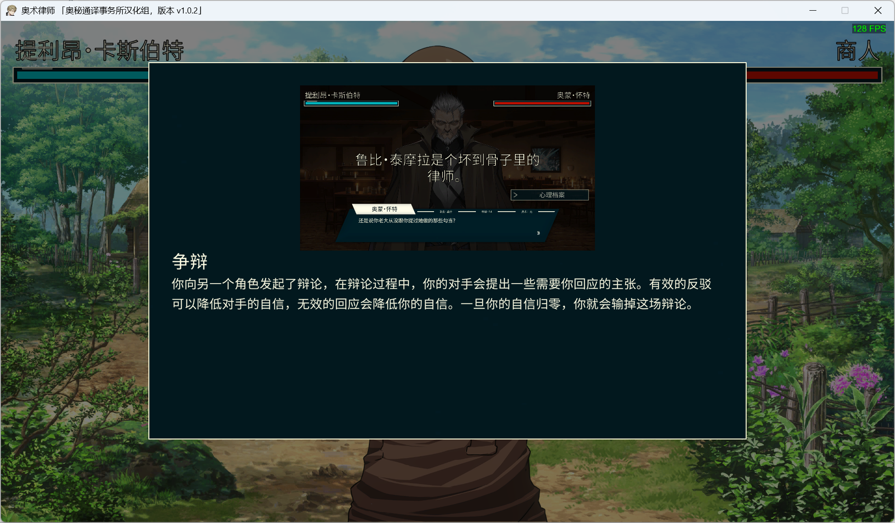
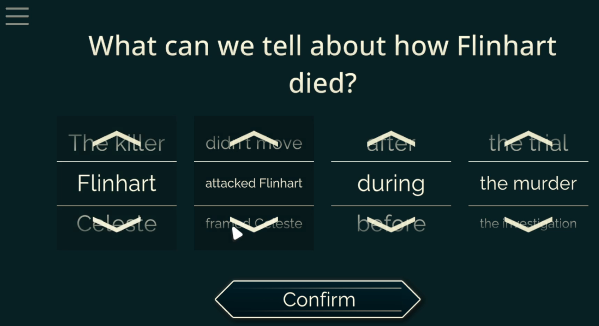

Russian Patch WIP

------------------------------

**20240303：汉化全部完成！撒花~**

steam 评论区链接：https://steamcommunity.com/id/KurikoMoe/recommended/1590230

2dfan 链接：https://2dfan.com/downloads/34253

其乐（steamcn）链接：https://keylol.com/t991746-1-1

> Unity 汉化教程在写啦，咕咕咕

## 运行图

<bold>让我们说中文！</bold>

<bold>Let's speek Chinese! </bold>

## 计划

程序媛一只，不会翻译，希望能找到人。

文本目前在 https://paratranz.cn/projects/12747 上进行汉化协作。可以自行提交加入申请。

汉化组工作群：862399169 (QQ)，需要翻译，校对，修图。

## 进度

> 参见 paratranz 网站公布进度

## License

This repository uses different licenses for its components:

1. **Source Code**: The source code is licensed under the [GNU General Public License v3.0 (GPLv3)](https://www.gnu.org/licenses/gpl-3.0.html).
2. **Assets**: The assets are licensed under the [Creative Commons Attribution-NonCommercial-ShareAlike 4.0 International License (CC BY-NC-SA 4.0)](https://creativecommons.org/licenses/by-nc-sa/4.0/).

Please ensure you comply with the terms of each license when using this repository.
