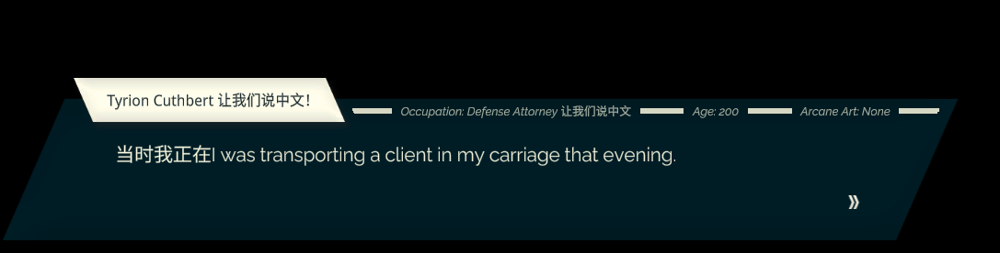

## 运行图

<bold>让我们说中文！</bold>

## 计划

程序媛一只，不会翻译，希望能找到人。

文本目前在 https://paratranz.cn/projects/12747 上进行汉化协作。可以自行提交加入申请。

汉化组工作群：862399169 (QQ)，需要翻译，校对，修图（大概）。

## 进度

### 文本汉化

- [x] 找出所有的 m_text
  - [x] 主界面文本在 level0 中，剩下大部分在 resource 中。
  - [x] 导出到 paratranz 脚本
  - [ ] paratranz 导入游戏脚本
- [x] 找出所有的人物介绍 （CharacterLibrary-level0-599.json）
  - [x] 导出到 paratranz 脚本
  - [ ] paratranz 导入游戏脚本

- [ ] 物品描述文本（SpellLibrary-level0-602.json）
  - [ ] 导出到 paratranz 脚本
  - [ ] paratranz 导入游戏脚本。
- [ ] default(en) 的剧本文件
  - [x] 导出到 paratranz 脚本
  - [ ] paratranz 导入游戏脚本。
- [ ] 其他待定

### 图片汉化（目前不涉及）

- [ ] 如果修的图少： UABEA 直接导入 png

- [ ] 如果修的图多：导出后修正 resS 文件再批量导入。

  

### 字库替换（完成）

>  这部分只能手动用 UABEA 操作的样子。

目前所有字体都替换成了同一个字体，需要有汉化组美工来推荐字体映射。原始字体放在 assets 文件夹。

需要修正的文件：

- SDC
  - m_Name
  - m_GameObject
    - m_FileID
    - m_PathID
  - m_Script
    - m_FileID
    - m_PathID
  - material
    - m_FileID
    - m_PathID
  - m_SourceFontFile 这个感觉不改也行，应该不是动态生成的，这部分可能只是个 editor 看的
  - m_FaceInfo
    - m_FamilyName
    - m_StyleName
  - m_AtlasTextures:
    - Array
      - m_FileId
      - m_PathID

- Material
  - m_Name
  - m_Shader
    - m_FileID
    - m_PathID
- Atlas
  - m_Name
  - 合理利用导出和 edit resS 文件

注意，TMPro 的 Monobehaviour 重导入可能会出错（表现为导入后 edit data 后显示序列化出错），此时重新导入直到 edit data 正常为止。
