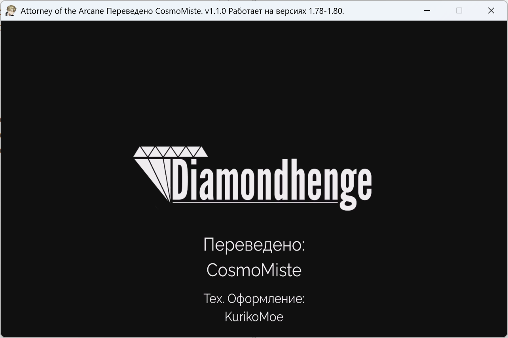
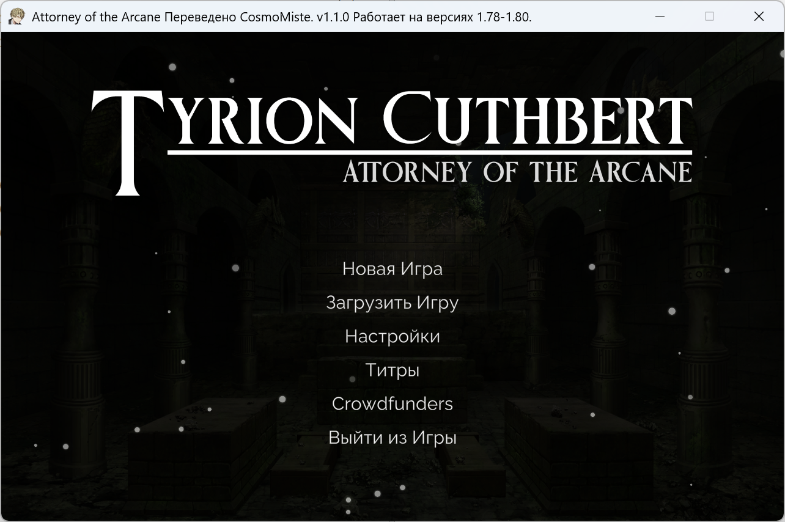
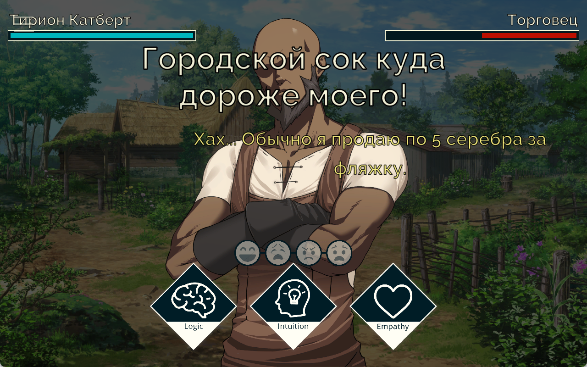
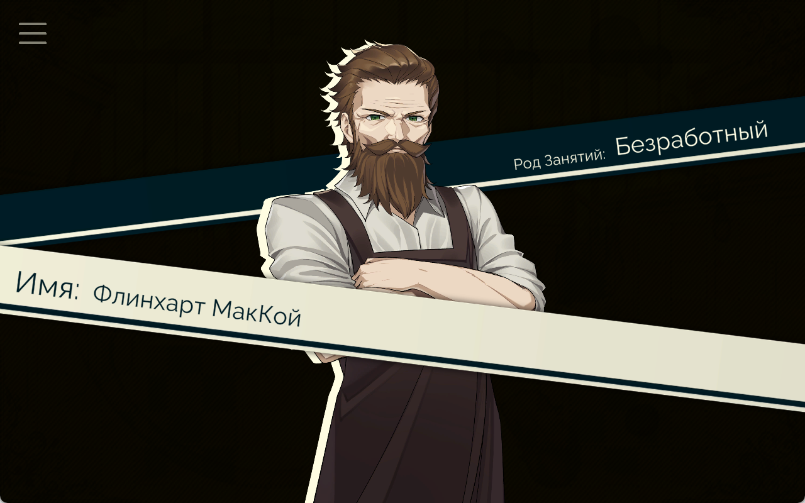

**Russian Patch WIP**

## Screenshots

<bold>Давайте говорить по-русски!</bold>

<bold>让我们说俄语！</bold>

<bold>Let's speak Russian!</bold>

## Plan

co-op @ https://paratranz.cn/projects/13897

## License

This repository uses different licenses for its components:

1. **Source Code**: The source code is licensed under the [GNU General Public License v3.0 (GPLv3)](https://www.gnu.org/licenses/gpl-3.0.html).
2. **Assets**: The assets are licensed under the [Creative Commons Attribution-NonCommercial-ShareAlike 4.0 International License (CC BY-NC-SA 4.0)](https://creativecommons.org/licenses/by-nc-sa/4.0/).

Please ensure you comply with the terms of each license when using this repository.
